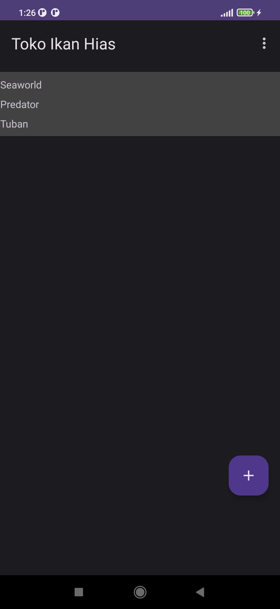
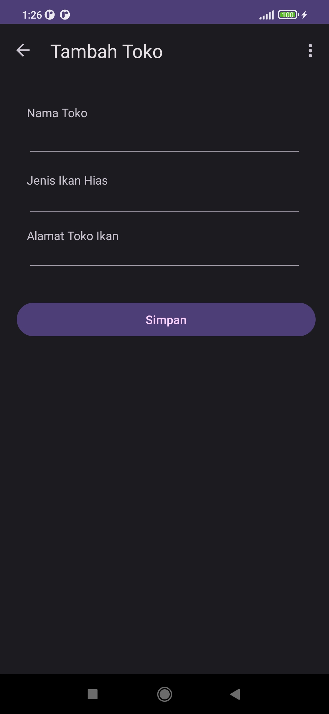
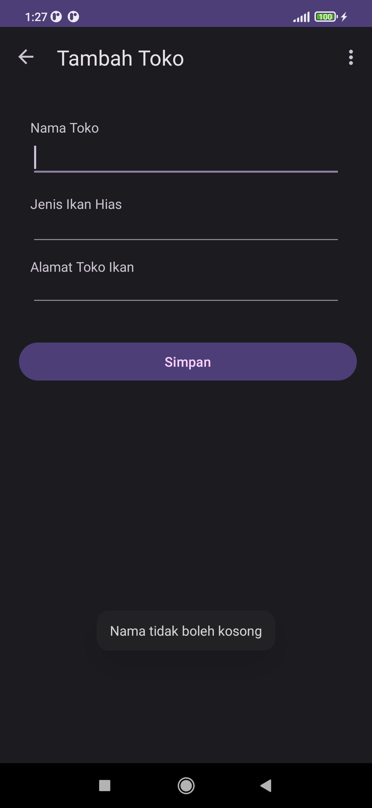
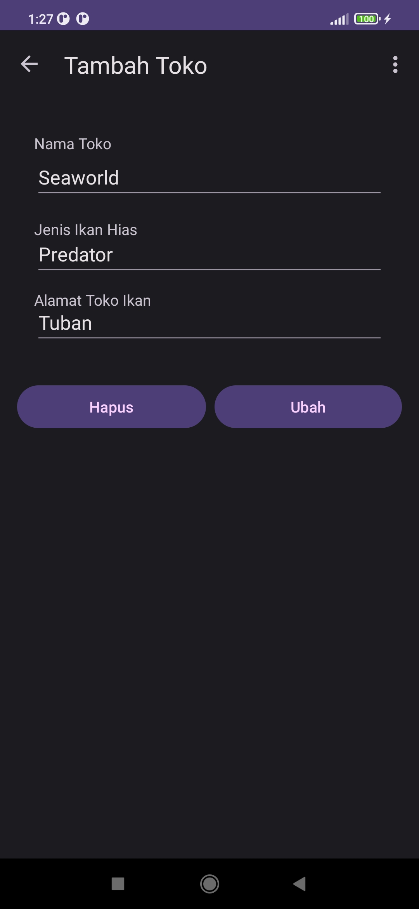
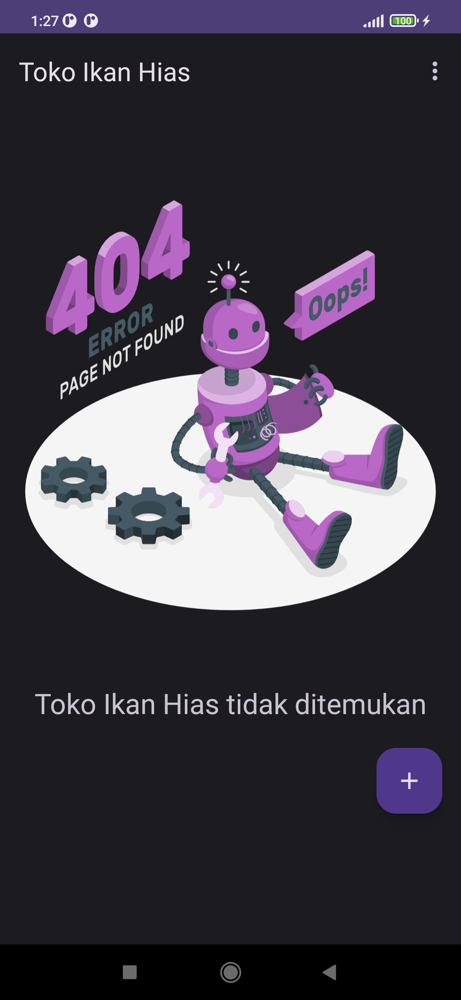

# Tokoikanhiasapp
 Tugas kuliah percobaan kedua
 ==============================

Halaman utama sebelum terhapus data nama jenis dan alamatnya

Input nama toko dan jenis ikan serta alamat

Inputan harus terisi tidak boleh kosong

Hasil secondFragment jika akan mengubah dan menghapus data Toko

Hasil Gambar setelah data Toko di Hapus

